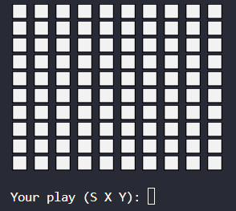
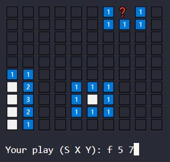
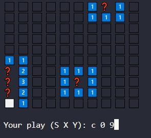
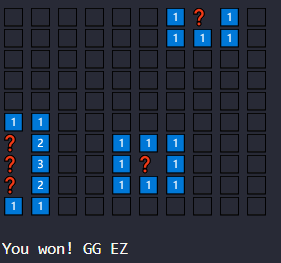
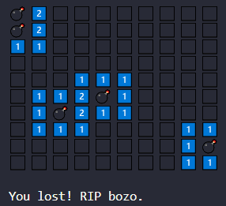

# Simple Terminal Minesweeper

This is a simple Python terminal-based minesweeper game built for fun.

## Features
- Random bomb placement
- Cool cell revealing logic
- Flag system
- Win/loss detection
- 100% played through terminal input

## Screenshots

## How to play

Run the script with Python 3. You can edit the PlayGame arguments to change how big the grid will be and the number of bombs.

The input will be based on the following format:

'SUFFIX X Y'

Suffix -> 'C' (click) or 'F' (flag/unflag) the cell
X and Y -> The coords of the cell

Example:
C 3 4 -> Clicks on the cell located at (3, 4)
F 9 4 -> Flags the cell located at (9, 4)

Same rules as normal minesweeper apply. If you click in a bomb, it's game over. If you manage to last until only the bomb cells remain empty, you win.

ps: Console gets cleared every turn for clarity.

Created by @AlysonCantalice.